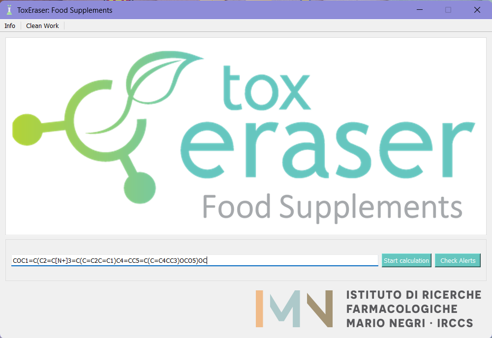

# Tox Eraser - Food Supplements

## What is it for?

ToxEraser Food Supplements is a software designed with the aim to identify risky food supplements and suggest safer alternatives as remedy. The first component of the tool is represented by an archive consisting of relevant lists and databases, which are described in detail in the **Appendix**. They are all drafted by panel of experts working on chemical risk assessment at Mario Negri institute. By assuming the selected lists as a source of independent information, the systematic evaluation of what resulted from their assessment was meant to offer a comprehensive classification of food supplements, at least in comparison with the classification endorsed by each single list.
Moreover, a read-across analysis enforces the substitution process, making the substitution possible even when the ingredient is not included in the archive. Finally, a series of structural alerts have been implemented in order to detect possible evidence of toxicity for different toxicological endpoints. The structural alerts implemented within the tools are extracted using the SARpy software and curated by IRFMN.
ToxEraser Food Supplements works with a single ingredient, entered in the Graphical User Interface (GUI).
ToxEraser Food Supplements is a stand-alone application and it has been designed with flexible capabilities for future extension in mind (possibility to add new lists of ingredients or set new functionalities).

## How to use it

### Requirements

Before proceeding, please check what version of Java is installed in your OPERATING SYSTEM (OS) and if the JAVA_PATH environment variable is correctly set [[download here](https://www.oracle.com/java/technologies/downloads/)] (for further details, please refer to Oracle documentation https://docs.oracle.com/cd/E19182-01/821-0917/inst_jdk_javahome_t/index.html). 
In few word, go to _Edit the sistem environment varibles_, create the new system and user variable named _JAVA_HOME_ and add the directory to the jdk folder. ToxEraser Food Supplements works with Java 8 or OpenJDK Java 11+. 

  

### Graphical User interface

1.	Download from [here](https://marionegri-my.sharepoint.com/personal/edoardo_vigano_marionegri_it/_layouts/15/onedrive.aspx?ga=1&id=%2Fpersonal%2Fedoardo%5Fvigano%5Fmarionegri%5Fit%2FDocuments%2FToxEraserEXE) all folders and unzip all files.
2.	Open the Dist/ToxEraserFoodSupplements.exe
3. Insert the SMILES of target molecules in _"Insert Target SMILES"_ and click on **Start calculation** bottom. In the same folder you can find the output. 

  

#### Other Functionalities

Clicking on **Check Alerts** bottom, the software check the presence of any Structural Alerts in the molecules and if it is present in any lists.

  

## Appendix

- TPPT list (Toxic Plant PhytoToxine) - [link to this list](https://www.agroscope.admin.ch/agroscope/en/home/publications/apps/tppt.html).
  The database consists of 1586 secondary metabolites from 844 plant species belonging to the Swiss territory but representative of Central Europe.
- GRAS list (Generally Recognized As Safe) - [link to this list](https://www.fda.gov/food/generally-recognized-safe-gras/gras-substances-scogs-database). This list has been extracted from the FDA (Food & Drug Administration) site and groups substances evaluated as safe, for the indicated uses, following scientific studies or history of consumption consolidated over time, if used in food before 1958. The substances in the SCOGS (Select Committee on GRAS Substances) database were used for modelling.
- Endogenous and common food supplements list - The lists of endogenous and commonly present substances in food derived from the list corresponding to the question Q1 (Normal body constituents) and Q22 (Common food components) of the Cramer decision tree implemented in the Toxtree program [[ref](https://toxtree.sourceforge.net/)]

## Contacts

Gianluca Selvestrel - Laboratory of Environmental Chemistry and Toxicology - Department of Environmental Health Sciences - Istituto di Ricerche Farmacologiche Mario Negri IRCCS - Via Mario Negri 2, 20156 Milano, Italy - e-mail: gianluca.selvestrel@marionegri.it

Sofia Ghironi - Laboratory of Environmental Chemistry and Toxicology - Department of Environmental Health Sciences - Istituto di Ricerche Farmacologiche Mario Negri IRCCS - Via Mario Negri 2, 20156 Milano, Italy - e-mail: sofia.ghironi@marionegri.it

Edoardo Luca Viganò - Laboratory of Environmental Chemistry and Toxicology - Department of Environmental Health Sciences - Istituto di Ricerche Farmacologiche Mario Negri IRCCS - Via Mario Negri 2, 20156 Milano, Italy - e-mail: edoardo.vigano@marionegri.it

Erika Colombo - Laboratory of Environmental Chemistry and Toxicology - Department of Environmental Health Sciences - Istituto di Ricerche Farmacologiche Mario Negri IRCCS - Via Mario Negri 2, 20156 Milano, Italy -e-mail: erika.colombo@marionegri.it

#### Author contribution
Conceptualization, G.S.; methodology, G.S. and S.G.; software, E.L.V., E.C; data curation, S.G., E.C. and G.S.; visualization, E.L.V and E.C.; supervision, G.S.

